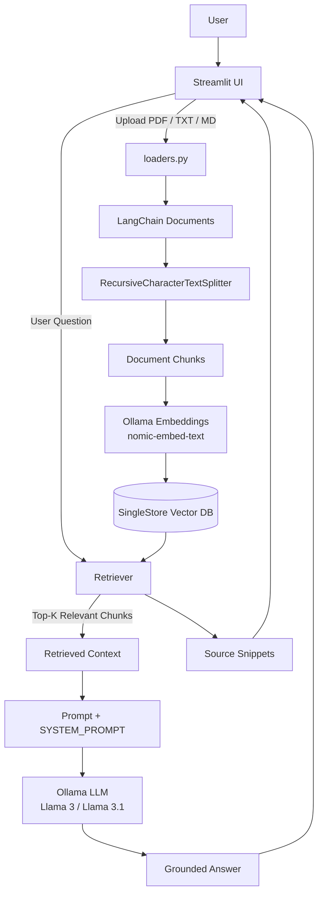

# 🧠 DocChat Pro — RAG Document Chatbot

> An end-to-end Retrieval-Augmented Generation (RAG) application that lets users chat with PDF, TXT, and Markdown documents using **LangChain, Ollama, SingleStore Vector Database, and Streamlit**.

DocChat Pro demonstrates the complete RAG pipeline:

**Document ingestion → chunking → embeddings → vector storage → semantic retrieval → context injection → local LLM generation → source display**

---
## Demo


## ✨ Features

- 📄 PDF, TXT, and Markdown document ingestion
- ✂️ Recursive character-based document chunking
- 🧠 Local embeddings using Ollama `nomic-embed-text`
- 🗄️ Persistent vector storage using SingleStore
- 🔎 Semantic Top-K retrieval
- 🤖 Local LLM inference with Ollama
- 💬 Streaming LLM responses
- 📚 Source snippets for retrieved documents
- 🛡️ Context-grounded answering
- 🎛️ Configurable chunk size and overlap
- 🎯 Configurable Top-K retrieval
- 🌡️ Configurable LLM temperature
- 🔍 Retrieved-chunk debugging
- 🗑️ Knowledge-base reset functionality

---

## 🏗️ Architecture



---

## 🔄 How the RAG Pipeline Works

### 1. Document ingestion

The user uploads PDF, TXT, or Markdown files through the Streamlit interface.

`loaders.py` converts each uploaded file into a LangChain `Document` containing:

- `page_content`
- `source` metadata

### 2. Chunking

The documents are split with LangChain's `RecursiveCharacterTextSplitter`.

Chunk size and overlap can be adjusted from the sidebar.

### 3. Embeddings

Each chunk is converted into a vector representation using:

```text
Ollama
└── nomic-embed-text
```

### 4. Vector storage

The chunks and their embeddings are stored in a SingleStore vector table.

This allows the knowledge base to persist beyond the current Streamlit session.

### 5. Retrieval

When a user asks a question, the application uses a vector retriever to find the most relevant chunks.

The number of retrieved chunks is controlled by **Top-K**.

### 6. Context construction

The retrieved chunks are combined into a context block and passed to the LLM together with the user's question.

### 7. Generation

The Ollama LLM generates the answer using the retrieved document context.

The system prompt instructs the model to avoid answering from unsupported information.

### 8. Sources

The retrieved document snippets are displayed under the **Sources** section so users can inspect the context used for the response.

---

## 🛠️ Tech Stack

| Category | Technology |
|---|---|
| Language | Python |
| UI | Streamlit |
| RAG Framework | LangChain |
| LLM | Ollama — Llama 3 / Llama 3.1 |
| Embeddings | Ollama — `nomic-embed-text` |
| Vector Database | SingleStore |
| PDF Processing | PyPDF |
| Text Splitting | LangChain RecursiveCharacterTextSplitter |
| Configuration | python-dotenv |

---

## 📁 Project Structure

```text
docchat-pro-rag-singlestore/
│
├── app.py                  # Streamlit UI and main RAG workflow
├── loaders.py              # PDF/TXT/MD document ingestion
├── prompts.py              # System prompt and grounding rules
├── rag_singlestore.py      # Chunking, embeddings, vector store and retrieval
│
├── screenshots/            # Add application screenshots here
│
├── docs/
│   └── architecture.md     # Architecture notes
│
├── .env.example            # Environment variable template
├── .gitignore              # Files excluded from Git
├── requirements.txt        # Python dependencies
└── README.md               # Project documentation
```

---

## ⚙️ Prerequisites

Before running the project, install:

- Python 3.9+
- Ollama
- A SingleStore database with vector support

### Ollama models

Pull the models used by the application:

```bash
ollama pull llama3
ollama pull llama3.1:8b
ollama pull nomic-embed-text
```

Make sure Ollama is running before starting the application.

---

## 🚀 Installation

### 1. Clone the repository

```bash
git clone https://github.com/ssrj25/rag-document-chatbot.git
cd rag-document-chatbot
```

### 2. Create a virtual environment

Windows:

```bash
python -m venv .venv
.venv\Scripts\activate
```

macOS / Linux:

```bash
python3 -m venv .venv
source .venv/bin/activate
```

### 3. Install dependencies

```bash
pip install -r requirements.txt
```

---

## 🔑 Environment Variables

Create a `.env` file in the project root.

You can use `.env.example` as the template:

```env
SINGLESTORE_HOST=
SINGLESTORE_PORT=3333
SINGLESTORE_USER=
SINGLESTORE_PASSWORD=
SINGLESTORE_DATABASE=
SINGLESTORE_TABLE=docchat_vectors
```

### ⚠️ Security

Never commit `.env` to GitHub.

The repository's `.gitignore` already excludes `.env`.

---

## ▶️ Run the Application

Start Streamlit:

```bash
streamlit run app.py
```

Then:

1. Open the local Streamlit URL.
2. Upload one or more PDF/TXT/Markdown files.
3. Click **Build / Upsert**.
4. Wait for the chunks to be embedded and stored.
5. Ask a question about the uploaded documents.
6. Inspect the retrieved chunks and source snippets.

---

## 💬 Example Workflow

```text
Upload document
      ↓
Build / Upsert
      ↓
Document chunks created
      ↓
Embeddings generated
      ↓
Stored in SingleStore
      ↓
Ask question
      ↓
Top-K chunks retrieved
      ↓
Context passed to Ollama
      ↓
Answer generated
      ↓
Sources displayed
```

---

## 🧪 Example Questions

If a document contains information about a company, you could ask:

```text
What are the main products mentioned in the document?
```

```text
What are the three key recommendations?
```

```text
What problem does the document describe?
```

For questions not supported by the uploaded context, the system prompt instructs the model to respond:

> "I don’t have that in the uploaded documents."

---

## 📸 Screenshots

Add screenshots from your running application to:

```text
screenshots/
├── home.png
├── chat.png
└── sources.png
```

Then reference them here:

```markdown

```

---

## 🧠 Design Decisions

### Why RAG?

RAG allows the application to retrieve relevant information from the user's documents before generating an answer, reducing the need for the model to rely only on its pretrained knowledge.

### Why SingleStore?

SingleStore provides persistent storage and vector similarity search for the document embeddings.

### Why Ollama?

Ollama enables local LLM and embedding inference without requiring a hosted LLM API for the generation pipeline.

### Why LangChain?

LangChain provides reusable components for document representation, text splitting, embeddings, retrieval, and prompt construction.

### Why Streamlit?

Streamlit provides a simple interactive interface for demonstrating the complete RAG workflow.

---

## ⚠️ Current Limitations

- PDF processing currently relies on text extraction and may not handle complex tables or images well.
- Retrieval quality depends on chunk size, overlap, and Top-K settings.
- The current retrieval pipeline does not include a separate reranking stage.
- Conversation memory is limited to the current Streamlit session.
- Ollama models must be installed locally.
- Individual document deletion is not currently exposed in the UI.

---

## 🔮 Future Improvements

- [ ] Hybrid keyword + vector search
- [ ] Retrieval reranking
- [ ] Metadata filtering
- [ ] Improved PDF/table extraction
- [ ] Multi-turn conversational memory
- [ ] Individual document deletion
- [ ] Automated RAG evaluation
- [ ] Retrieval-quality metrics
- [ ] Docker support
- [ ] Cloud deployment
- [ ] Authentication

---

## 📚 Key Learning Outcomes

This project was built to understand the RAG pipeline end-to-end, including:

- Document ingestion
- Text chunking
- Embedding generation
- Vector databases
- Semantic retrieval
- Retriever configuration
- Context construction
- Prompt grounding
- Local LLM inference
- Streaming responses
- Source attribution
- Streamlit session state

---

## 👩‍💻 Author

**Shreya Singh**

GitHub: [@ssrj25](https://github.com/ssrj25)

---

## 📄 License

This project is licensed under the MIT License.
