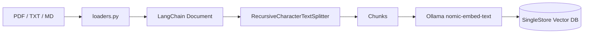
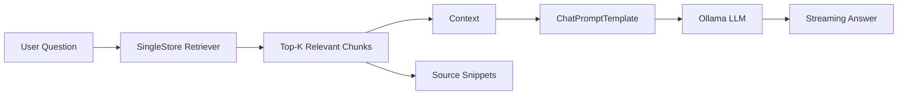

# Architecture

## Ingestion and indexing

## Retrieval and generation

## Module responsibilities

- `app.py` — UI, indexing orchestration, retrieval, prompting and streaming response.
- `loaders.py` — converts uploaded files into LangChain `Document` objects.
- `rag_singlestore.py` — chunking, embeddings, SingleStore vector store and source formatting.
- `prompts.py` — grounding instructions used by the generation step.
